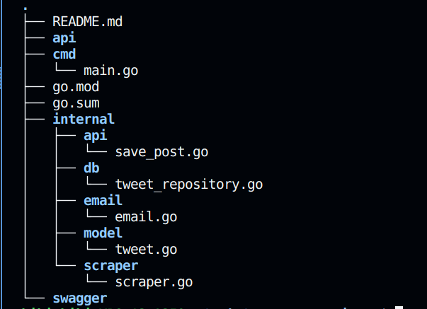
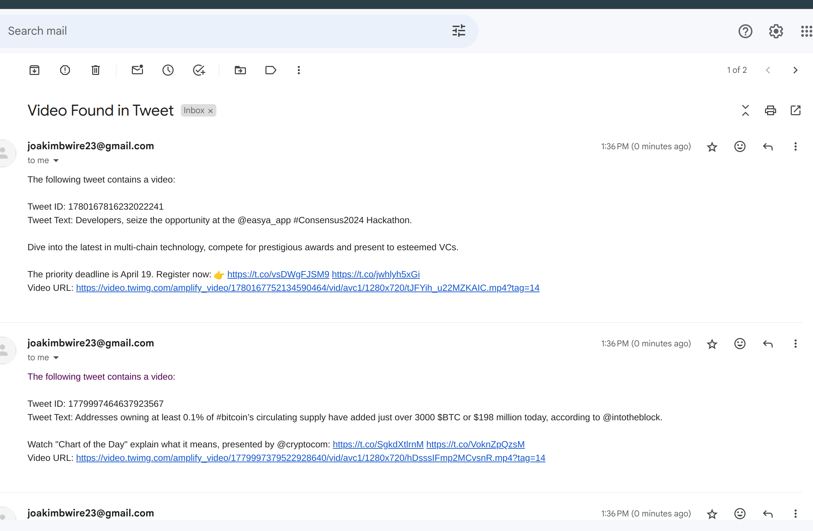
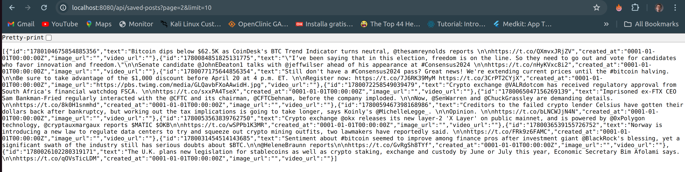

# Twitter Scraper API

A simple API that scrapes tweets from a specific Twitter account and saves them to a PostgreSQL database.

## Prerequisites
* A PostgreSQL server running on `localhost:5432`


## Setup
1. Clone the repository to your local machine.
2. Navigate to the project directory.
3. Set up your PostgreSQL database and note down the credentials.
4. Replace the following placeholders in the code with your actual database credentials:
    * `dbUsername` with your PostgreSQL username
    * `dbPassword` with your PostgreSQL password
    * `dbHost` with your PostgreSQL host (default is `localhost`)
    * `dbPort` with your PostgreSQL port (default is `5432`)
    * `dbName` with your PostgreSQL database name
5. Run the application.

## Email Configuration
1. Generate an app password for your email account. This is usually done through your email provider's security settings.
2. Replace the following placeholders in the code with your actual email configuration:
    * `sender` with your email address
    * `password` with your generated app password
    * `recipient` with the recipient's email address

## Twitter Configuration
1. Navigate to the `scraper` folder in the project directory.
2. Locate the `ScrapeTweets` function in the code.
3. Replace the following placeholders in the code with your actual Twitter credentials:
    * `username` with your Twitter username
    * `password` with your Twitter password

## Project Structure
    Here is a basic layout of the project structure:
    ├── README.md
    ├── api
    ├── cmd
    │   └── main.go
    ├── go.mod
    ├── go.sum
    ├── images
    │   └── tree.png
    ├── internal
    │   ├── api
    │   │   └── save_post.go
    │   ├── db
    │   │   └── tweet_repository.go
    │   ├── email
    │   │   └── email.go
    │   ├── model
    │   │   └── tweet.go
    │   └── scraper
    │       └── scraper.go
    └── swagger
    

## Output of the project
The project accomplishes the following:

1. It scrapes tweets from a specified Twitter account and saves them in a PostgreSQL database. This includes text, images, and videos from the tweets.

    


2. It sends an email notification whenever a tweet with a video is scraped. This feature is useful for users who want to be immediately notified of video content.

    

3. It provides a GET API for retrieving the saved posts with pagination. This allows for efficient retrieval of tweets, especially when dealing with a large number of saved tweets.

    


## Database Setup

    Before running the application, you need to set up the PostgreSQL database. Here are the steps:

    1. Open your PostgreSQL command line interface.
    2. Create the database using the following command:
        ```sql
        CREATE DATABASE twitter_scraper;
        ```
    3. Connect to the newly created database:
        ```sql
        \c twitter_scraper;
        ```
    4. Create the `tweets` table:
        ```sql
        CREATE TABLE tweets (
            tweet_id VARCHAR(255) PRIMARY KEY,
            text TEXT,
            created_at TIMESTAMP,
            image_url TEXT,
            video_url TEXT
        );
        ```
    Now your database is ready to store tweets.
    
## Running the Application
1. Navigate to the project directory.
2. Run the command `go run main.go` to start the application.
3. The application will start running and scraping tweets from the specified Twitter account.


## Contributing

I'd love to get feedback on this project. If you have suggestions or ideas, please open an issue or submit a pull request.

Thank you!


